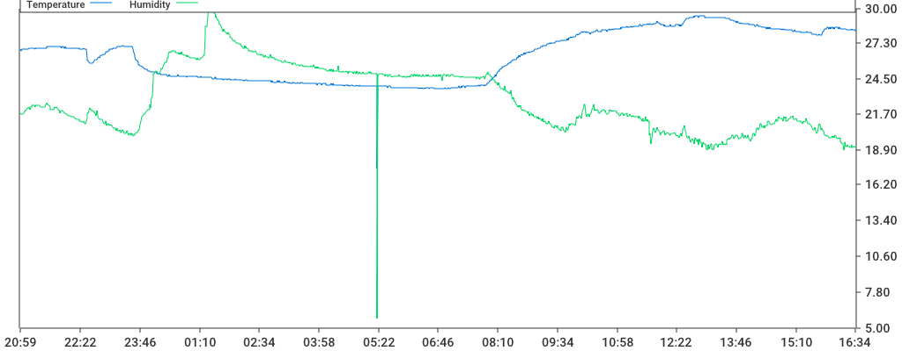

# Atmohome - telegram bot that measures temperature and humidity written in golang

### Rapbserry Pi crontab -e
```
*/5 * * * * python3 /home/pi/dht22.py > /dev/null 2>&1
```

### Build telegram bot for ARM arch
```bash
$ go mod download
$ GOOS=linux GOARCH=arm GOARM=5 CGO_ENABLED=1 go build -v -o atmohome main.go
```

### Bot commands
* / - show keyboard
* last - presents last measurement
* day - renders graph with measurements during last 24 hours

### Systemd service `/lib/systemd/system/atmohome.service`
```ini
[Unit]
Description=Atmohome
DefaultDependencies=no
After=network.target

[Service]
WorkingDirectory=/home/pi
Type=simple
RemainAfterExit=yes
ExecStart=/home/pi/atmohome
Restart=on-failure
RestartSec=30s

[Install]
WantedBy=multi-user.target
```

### Example

