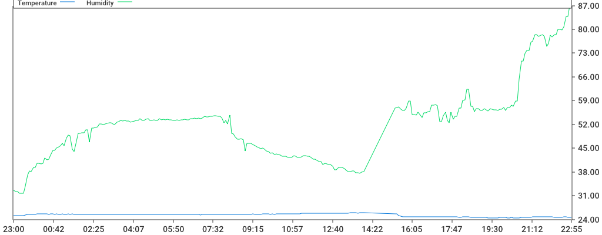

# Atmohome - telegram bot that measures temperature and humidity written in golang

### Rapbserry Pi crontab -e
```
*/5 * * * * python3 /home/pi/dht22.py > /dev/null 2>&1
```

### Build telegram bot for ARM arch
```bash
$ go mod download
$ GOOS=linux GOARCH=arm GOARM=5 go build .
```

### Bot commands
* / - show keyboard
* last - presents last measurement
* day - renders graph with measurements during last 24 hours

### Example

